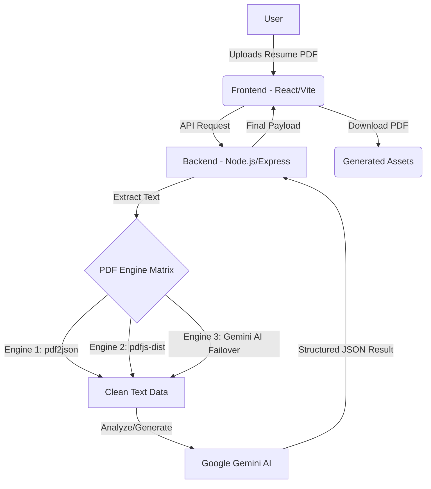

# 🚀 ApplyFlow.ai — Engineering Your Career Narrative 🤖

<div align="center">


[](https://github.com/ayush-ranjan9135/AI-Cover-Letter-Generator/blob/main/LICENSE)
[](https://github.com/ayush-ranjan9135/AI-Cover-Letter-Generator/stargazers)
[](https://github.com/ayush-ranjan9135/AI-Cover-Letter-Generator/network)
[](https://react.dev/)
[](https://nodejs.org/)
[](https://deepmind.google/technologies/gemini/)

**Elevate your professional profile with neural intelligence tailored to elite organizational demands.**

[Features](#-key-features) • [Architecture](#-system-architecture) • [Workflow](#-project-flow) • [Tech Stack](#-tech-stack) • [Setup](#-getting-started) • [Contact](#-connect-with-me)

</div>

---

## 🧠 What is ApplyFlow.ai?

**ApplyFlow.ai** is a premium, AI-powered career workspace designed for high-impact job seekers. It leverages advanced neural synthesis to bridge the gap between your unique professional history and specific organizational requirements.

Whether you're targeting a specialized engineering role or a creative leadership position, ApplyFlow.ai ensures your narrative is **precise**, **persuasive**, and **ATS-optimized**.

---

## 🏗️ System Architecture

ApplyFlow.ai follows a modern full-stack architecture with a triple-engine extraction system to ensure maximum reliability.



---

## 🔄 Project Flow

1.  **🖱️ Interactive Entry**: The workspace greets you with a sophisticated glassmorphism UI featuring interactive mouse-spotlight dynamics.
2.  **📄 Intelligent Intake**: Upload your resume in PDF format. Our backend employs a cascading extraction logic to recover text even from complex layouts.
3.  **🎯 Context Injection**: Provide the target job role and specific keywords or job descriptions.
4.  **⚡ Neural Synthesis**:
    *   **ATS Score**: The system performs a semantic gap analysis, providing a compatibility score and actionable feedback.
    *   **Cover Letter**: Gemini AI generates a high-resonance, professionally formatted cover letter.
5.  **📥 Export & Success**: Review your results and export them as a professionally structured business document.

---

## ✨ Key Features

### 💎 Premium Interaction UI
- **Neural Mouse Spotlight**: Sophisticated radial cursor-glow system.
- **3D Tilt Dynamics**: Tactile workspace cards utilizing `framer-motion`.
- **Glassmorphism Design**: Sleek, semi-transparent UI with fluid gradients.

### 🧠 Intelligent Career Tools
- **Neural Synthesis**: High-resonance cover letter generation via **Google Gemini Flash**.
- **ATS Compatibility Matrix**: Real-time analysis with an interactive scoring gauge.
- **Multi-Engine PDF Parser**: Triple-fallback system (pdf2json -> pdfjs -> Gemini) for 100% text recovery.

---

## 🛠️ Tech Stack

| Component | Technology |
| :--- | :--- |
| **Frontend** | React 18, Vite 6, Framer Motion, Axios |
| **Backend** | Node.js, Express, Multer |
| **AI Integration** | Google Generative AI (Gemini 2.5 Flash) |
| **PDF Processing** | pdf-parse, pdfjs-dist, jsPDF |
| **Styling** | Vanilla CSS, Glassmorphism, Responsive Grid |

---

## 🚀 Getting Started

### 1️⃣ Installation
```bash
# Clone the repository
git clone https://github.com/ayush-ranjan9135/AI-Cover-Letter-Generator.git
cd AI-Cover-Letter-Generator

# Install Dependencies
cd backend && npm install
cd ../frontend && npm install
```

### 2️⃣ Environment Setup
Create `backend/.env`:
```env
PORT=5000
GEMINI_API_KEY=your_google_ai_key_here
```

### 3️⃣ Launch
```bash
# From root
npm run dev
```
Workspace: `http://localhost:5173` 🌐

---

## 🌐 Connect With Me

Let's build the future of career technology together! 🚀

<div align="center">

[](https://alpha-portfolio-five.vercel.app/)
[](https://www.linkedin.com/in/ayush-ranjan-9135d3/)
[](https://github.com/ayush-ranjan9135)
[](https://www.instagram.com/ayush.__.srivastava?igsh=dW1zdHFjcTZnenV2)
[](https://www.facebook.com/share/1AhB4q1WeW/)

</div>

---

## ⚖️ License
Distributed under the MIT License. See `LICENSE` for more information.

---
**Created with precision by [Ayush Ranjan](https://github.com/ayush-ranjan9135) 🚀🔥**
